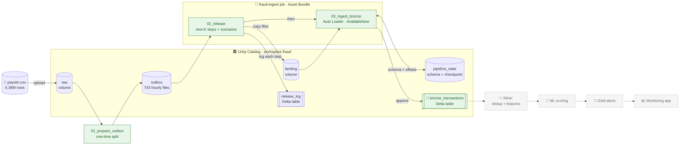

# 🛡️ Databricks Fraud Detection

## ⚡ Quick Summary

Mobile-money apps move millions of payments a day, and a small share of them
are fraud. This project builds the system a bank's data team would use to
catch it. Transactions flow in continuously, get cleaned and organised, are
scored by a machine-learning model, and suspicious ones surface as alerts on
a dashboard. Everything runs on **Databricks**, the data platform many large
companies use for this work, using only its free tier.

The build is done in phases, and each phase is proven with real runs before
the next begins. **Phase 2 is done:** about 6 million simulated transactions
were streamed into the platform and checked against their expected counts.
Every count matched exactly. The runs included deliberately staged problems:
a file sent twice, a file that arrived late, a new column appearing
mid-stream, and corrupted values.

### Streaming fraud detection on a Databricks lakehouse, built in verified steps, measured rather than claimed

---

## 🏷️ Project Badges

[](https://www.databricks.com/)
[](https://spark.apache.org/)
[](https://docs.databricks.com/aws/en/ingestion/cloud-object-storage/auto-loader/)
[](https://delta.io/)
[](https://docs.databricks.com/aws/en/data-governance/unity-catalog/)
[](https://docs.databricks.com/aws/en/dev-tools/bundles/)

[](https://www.python.org/)
[](tests/README.md)
[](https://github.com/deepan-mehta-analytics/databricks-fraud-detection/actions)
[](https://github.com/deepan-mehta-analytics/databricks-fraud-detection/releases)
[](PROJECT-STATUS.md)
[](LICENSE)

---

## 📌 Project Overview

This project implements **an event-driven fraud pipeline on the Databricks
lakehouse**. Every architecture claim is checked against current docs or a
real run before it is adopted.

It uses the [PaySim](https://www.kaggle.com/datasets/ealaxi/paysim1)
mobile-money simulation (6.36M transactions) and replays it as a live event
stream through **Auto Loader into a Unity Catalog medallion layout**.

**✅ Implemented and verified (Phase 2: ingest to Bronze)**

- **Replayable event stream**: a splitter turns the CSV into 743 hourly JSON Lines files, and a release task drops them into a landing volume a few hours at a time
- **Auto Loader ingest**: incremental file discovery, pinned schema hints, `addNewColumns` schema evolution, rescued data, and an exactly-once checkpoint on a UC Volume
- **Staged failure scenarios**: duplicate delivery, late arrival, a new column mid-stream and malformed values, each switched on per run and each proven with a SQL check
- **Jobs as code**: a two-task Databricks job (release → ingest) declared in an Asset Bundle and deployed from the workspace UI, with no token
- **Guarded parameters**: scenario settings that can't take effect raise an error before any file is copied
- **Tested and CI-gated**: 44 local unit tests, and a GitHub Actions job running hygiene checks plus tests on every push

**🔜 Planned**

- **Silver**: deduplication, filtering of invalid rows, velocity features
- **ML**: fraud model training and in-stream scoring
- **Gold and governance**: alert tables, group grants, row filters and column masks
- **Monitoring app**: alert dashboard and job alerting

**🧭 Engineering principles**

- **Research first**: every claim in the original brief is re-verified and logged in [`docs/GAPS.md`](docs/GAPS.md) before adoption
- **Measured results only**: no number is reported unless it came from a real run
- **Decisions on record**: seven ADRs in [`docs/adr/`](docs/adr/) capture each choice and what it cost
- **Cost-disciplined and public-safe**: free tier only, placeholders for every workspace identifier

---

## ⚙️ Tech Stack

| Layer | Tool | Purpose |
|---|---|---|
| ☁️ Platform | Databricks Free Edition (serverless) | Compute, jobs, SQL warehouse; limits verified (G-08) |
| 📥 Ingestion | Auto Loader (`cloudFiles`) | Incremental JSON Lines ingest with schema hints, evolution and rescued data |
| 🔄 Stream engine | Spark Structured Streaming, `Trigger.AvailableNow` | Batch-style streaming, the trigger serverless supports (G-02) |
| 🗄️ Storage | Delta Lake | Append-only Bronze table and the release log |
| 🏛️ Governance | Unity Catalog: schema, 4 Volumes, grants | Files, checkpoints and tables under one namespace; row filters and masks verified (G-06) |
| 💾 Checkpoints | Unity Catalog Volume | DBFS root is deprecated (G-03) |
| 🧩 Orchestration | Databricks Jobs + Asset Bundle (`databricks.yml`) | Two-task job as code, deployed from the workspace UI (G-11) |
| 🔗 Code delivery | Databricks Git folder | Workspace runs use this repo at a known commit (G-12) |
| 🐍 Language | Python 3.11 (stdlib-only package) | Splitter, release logic, scenario transforms |
| 🧪 Testing | pytest (44 tests), PyYAML | Contract, split, scenarios, release, ingest options, job definition |
| ⚙️ CI | GitHub Actions | Hygiene check + unit tests on every push |
| 📊 Data | PaySim (CC BY-SA 4.0) | Synthetic mobile-money transactions with fraud labels |

---

## 🎯 Business Problem

Fraud teams need suspicious payments flagged fast, from data that arrives
continuously and messily: late, duplicated, with changing formats. Real
streaming stacks (Kafka, dedicated clusters) are expensive to run, and on
this free tier they are blocked outright (G-01).

> **How quickly can a mobile-money transaction be flagged as likely fraud,
> and can the whole path — messy ingest to alert — be shown end to end on
> free infrastructure, with every number measured?**

---

## 🏗️ Architecture



*Solid lines are built and verified; dashed nodes are planned phases.*

| Component | Type | Role |
|---|---|---|
| `01_prepare_outbox` | Notebook (one-time) | Splits the CSV into 743 per-hour JSON Lines files, 336 backfill / 72 replay / 335 drift |
| `02_release` | Job task 1 | Copies the next K steps into `landing`, applies any scenario flags, logs each step |
| `03_ingest_bronze` | Job task 2 | Auto Loader stream: reads new landing files, appends to Bronze, stops when caught up |
| `release_log` | Delta table | One row per released or held step, the replay pointer |
| `bronze_transactions` | Delta table | Raw events plus `source_file`, `file_arrived_at`, `ingested_at`, `_rescued_data` |
| `pipeline_state` | UC Volume | Auto Loader schema location and streaming checkpoint |

| Phase | Layer | Status |
|---|---|---|
| 0 | Research, gaps register, ADRs | 🔄 10 of 12 gaps resolved |
| 1 | Scaffolding, CI | ✅ Done |
| 2 | Ingest to Bronze | ✅ Verified 2026-09-24 |
| 3 | Silver and features | ⏳ Next |
| 4 | Training and scoring | ⏳ |
| 5 | Gold alerts and governance | ⏳ |
| 6 | Monitoring app and alerting | ⏳ |
| 7 | Live demo window and teardown | ⏳ |

---

## 📁 Repository Structure

```
databricks-fraud-detection/
│
├── src/fraud_ingest/              ← stdlib-only package, unit-tested locally
│   ├── contract.py                ← record contract: segments, file names, IDs, timestamps, schema hints
│   ├── split.py                   ← CSV → 743 hourly JSON Lines files
│   ├── scenarios.py               ← schema-change and malformed-value transforms
│   ├── release.py                 ← release pointer, flag validation, per-run copy
│   ├── release_log.py             ← in-memory + Delta release-log stores
│   └── ingest.py                  ← Auto Loader options and stream builder
│
├── notebooks/                     ← Databricks entry points
│   ├── 01_prepare_outbox.py       ← one-time split (V1)
│   ├── 02_release.py              ← job task: release next steps
│   ├── 03_ingest_bronze.py        ← job task: Auto Loader → Bronze
│   └── 99_reset.py                ← drop state to rerun from scratch
│
├── sql/
│   ├── 10_fraud_ingest_setup.sql  ← schema, 4 volumes, release_log (run once)
│   └── 20_verify_bronze.sql       ← V2–V4 checks + one-row check of every proof
│
├── resources/
│   └── fraud_ingest_job.yml       ← job: release → ingest, retries, paused schedule
├── databricks.yml                 ← Asset Bundle root (dev target)
│
├── tests/                         ← 44 pytest tests (see tests/README.md)
├── docs/
│   ├── adr/                       ← ADRs 0001–0007
│   ├── GAPS.md                    ← brief-vs-reality register + accepted limitations
│   ├── ENGINEERING-DECISIONS.md   ← decision log
│   ├── cost-model.md              ← free-tier cost tracking
│   └── 00-initial-brief.md        ← original non-binding brief
│
├── app/                           ← monitoring app (Phase 6)
├── data/                          ← local datasets (gitignored)
├── .github/workflows/ci.yml       ← hygiene + unit-test jobs
├── Makefile                       ← check-hygiene, test (lint/deploy/teardown: honest stubs)
├── pyproject.toml                 ← pytest config
├── requirements-dev.txt           ← pytest, PyYAML
├── .env.example                   ← placeholder configuration
└── PROJECT-STATUS.md              ← phase tracker
```

---

## ▶️ How to Run

### 💻 Option 1: Local unit tests (no Databricks needed)

#### 1. Clone and install
```bash
git clone https://github.com/deepan-mehta-analytics/databricks-fraud-detection.git
cd databricks-fraud-detection
python -m pip install -r requirements-dev.txt
```

#### 2. Run the checks
```bash
python -m pytest -q      # 44 unit tests (or: make test)
make check-hygiene       # no local-only or secret file is tracked
make help                # lint / deploy / teardown are stubs until their phase lands
```

### ☁️ Option 2: Databricks Free Edition workspace

This is the path used for the 2026-09-24 verification. Every step is done by
hand in the workspace UI.

1. **Git folder**: Workspace → Home → Create → Git folder → this repo's URL. A public clone needs no token (G-12)
2. **Setup SQL**: in the SQL editor, on a **SQL warehouse**, run `sql/10_fraud_ingest_setup.sql` once
3. **Data**: download PaySim, then Catalog → `workspace.fraud.raw` → upload `paysim.csv`
4. **Split (V1)**: run `notebooks/01_prepare_outbox` on serverless; it prints `V1 passed`
5. **Deploy the job**: open `databricks.yml` → deployments icon 🚀 → target `dev` → Deploy (G-11)
6. **Run the job** in this order. Scenario settings go in **Run now ⌄ → Run now with different settings**, which applies them to that run only; never edit the job's defaults:

   | Run | Settings | Releases |
   |---|---|---|
   | 1 | none | backfill, steps 1–336 |
   | 2 | none | 337–342 |
   | 3 | `duplicate_step=340`, `hold_steps=345` | 343–348 without 345, plus a copy of 340 |
   | 4 | `malformed_step=350`, `malformed_rows=5` | 349–354 |
   | 5 | `release_held=true`, `schema_change_from_step=360` | 355–360 plus the late 345; ingest fails once, then retries |
   | 6 | `steps_per_run=48` | 361–408 |
   | 7 | none | nothing: prints "Nothing to release" |

7. **Verify**: run the one-row check at the end of `sql/20_verify_bronze.sql` and compare with the Results below

### ⚙️ Option 3: CI (GitHub Actions)

Every push to `main` runs `.github/workflows/ci.yml`: a **hygiene** job (no
secrets or local-only files tracked) and a **test** job (Python 3.11,
pytest).

---

## 🧪 Tests

```bash
python -m pytest -q      # → 44 passed
```

| File | What it covers |
|---|---|
| `test_contract.py` | Segment boundaries, file naming, transaction ID and timestamp derivation, schema hints, volume paths |
| `test_split.py` | One file per step, field names and types, deterministic IDs, sort-order enforcement, custom anchor |
| `test_scenarios.py` | The `channel` and malformed-`amount` transforms in isolation |
| `test_release_core.py` | Backfill-first, K-per-run pacing, crash/resume repair, parameter validation, batched logging |
| `test_release_scenarios.py` | Duplicate, late, schema-change and malformed scenarios as applied by `run_release` |
| `test_ingest.py` | Auto Loader option construction; module imports without PySpark |
| `test_job_definition.py` | Bundle YAML: task graph, retry, schedule, parameter list |

Notebook behaviour, the Delta tables and Auto Loader itself are verified by
workspace runs (V1–V6), not by this local suite. File-by-file detail is in
[`tests/README.md`](tests/README.md).

---

## 📊 Results / Performance

> **Phase 2 verified on Databricks Free Edition, 2026-09-24.** Serverless
> compute (performance-optimized jobs); code from this repo's Git folder at
> commit `601e7da`; job deployed as an Asset Bundle from the workspace UI.

### ✅ Correctness: every expected value matched exactly

| Check | Expected | Measured |
|---|---|---|
| V1 split: rows / fraud / files | 6,362,620 / 8,213 / 743 | ✅ exact |
| V2 after backfill: rows / fraud / distinct IDs | 4,784,775 / 3,767 / 4,784,775 | ✅ exact |
| V3 final: rows / fraud / distinct IDs | 5,987,427 / 4,599 / 5,987,417 | ✅ exact |
| Every row has a parsed event time (`null_times`) | 0 | ✅ 0 |
| 🔁 Duplicate file: step-340 IDs seen twice | 10 | ✅ 10 |
| ⏰ Late file: last step to arrive among 343–348 | 345 | ✅ 345 |
| 🧬 Schema change: `channel` before step 360 / missing from 360 on | 0 / 0 | ✅ 0 / 0 |
| 🩹 Malformed values kept in `_rescued_data` | 5 | ✅ 5 |
| New column: ingest fails once (`UNKNOWN_FIELD_EXCEPTION`), auto-retry succeeds | yes | ✅ yes |
| Replay finished: next run releases nothing | "Nothing to release" | ✅ printed |
| V6: job deploys as code on Free Edition | — | ✅ from the UI, no token |

### ⏱️ Runtimes (single runs, not averages)

| Run | What it did | Duration |
|---|---|---|
| Split notebook | 6.36M-row CSV → 743 JSON Lines files | ~7 min |
| Job run 1 | backfill: 336 files, 4,784,775 rows | 4m 22s |
| Job runs 2–5 | 6 steps each, plus the duplicate, late and malformed scenarios | 1m 0s – 1m 34s |
| Job run 6 | remaining 48 replay steps, 801,360 rows | 2m 35s |
| Job run 7 | nothing left: "Nothing to release" | 18s |

### 📉 Pipeline lag (`ingested_at − file_arrived_at`, per file, 409 files)

| Run | Files | Min / median / max (s) |
|---|---|---|
| Backfill | 336 | 48 / 127 / 193 |
| 6-step runs (2–5) | 25 | 14 / 20–28 (per-run medians) / 39 |
| 48-step run | 48 | 14 / 67 / 124 |

💡 **What the lag actually measures.** It reflects this batch design, not
Auto Loader's detection speed. The release task copies files one at a time
and ingest starts only when release finishes, so the first file copied in a
run waits longest. The ~14 s floor is the hand-off between the two tasks plus
stream start-up.

No model metrics yet: training starts in Phase 4.

---

## ⚠️ Known Limitations

- **Single verification day**: Phase 2 figures are single runs, not averages. The daily compute quota is still unknown; only that one day's runs fit inside it (G-08)
- **Invalid JSON is silent**: a line that is not valid JSON lands as one all-null row (its text is lost, and the run succeeds). The `null_times` check flags it, and Silver will filter it (GAPS §3, V5)
- **No Kafka on this tier**: serverless compute cannot even resolve untrusted hostnames (measured), so Confluent Kafka is out. Events are replayed as files instead (G-01)
- **Not sub-second streaming**: Real-Time Mode needs classic compute. Serverless supports `AvailableNow` and Lakeflow pipelines only (G-02)
- **Synthetic, uneven data**: PaySim is a simulation. Legitimate volume collapses after simulated day 17 while fraud stays constant, so days 1–17 are used for training and scoring, and days 18–31 are held back as a drift scenario (G-10)
- **Storage duplication**: landing files are kept after ingest, so the data sits in the workspace about three times (CSV, outbox, landing) plus Bronze. There is no stated storage quota; `cleanSource` archiving is not yet implemented
- **Retry with changed flags**: if a failed release is retried with different scenario flags, a step can land twice; recovery is `99_reset`
- **Open gaps**: G-05 (model metrics, which need training) and G-09 (cost recompute) in [`docs/GAPS.md`](docs/GAPS.md)

## 🔜 Roadmap

- [ ] Phase 0: research and ADRs (10 of 12 gaps resolved)
- [x] Phase 1: scaffolding and CI
- [x] Phase 2: ingest to Bronze (44 unit tests; workspace V1–V6 verified 2026-09-24)
- [ ] Phase 3: Silver (dedup on `transaction_id`, invalid-row filter, velocity features)
- [ ] Phase 4: ML training and in-stream scoring
- [ ] Phase 5: Gold alerts and Unity Catalog governance
- [ ] Phase 6: monitoring app and alerting
- [ ] Phase 7: live demo window and teardown
- [ ] Databricks Data Engineer Associate coverage map

---

## 📂 Dataset

**[PaySim](https://www.kaggle.com/datasets/ealaxi/paysim1)** mobile-money
transaction simulator · licence **CC BY-SA 4.0** · chosen in ADR 0006 over
the originally planned Kaggle Credit Card Fraud dataset (G-04).

| Property | Value (verified from the downloaded file) |
|---|---|
| Rows | 6,362,620 |
| Fraud (`isFraud=1`) | 8,213 (~0.129%) |
| Flagged fraud (`isFlaggedFraud=1`) | 16 |
| Time span | steps 1–743, 1 step = 1 hour (~30 days) |
| Columns | `step, type, amount, nameOrig, oldbalanceOrg, newbalanceOrig, nameDest, oldbalanceDest, newbalanceDest, isFraud, isFlaggedFraud` |

⚠️ The balance columns leak the label (they are zeroed after fraud), so they
are excluded from features (ADR 0006). Volume is not uniform over time (G-10).

---

## 📜 License

Released under the MIT License. See [`LICENSE`](LICENSE).

---

## 👤 Author

**Deepan Mehta**

- Data Analytics → Data Engineering → AI/ML Engineering
- Focused on building end-to-end data and ML systems combining analytics, automation, and deployment
- Experience in ETL pipelines, streaming ingest, predictive modelling, and analytical databases

🔗 GitHub: [deepan-mehta-analytics](https://github.com/deepan-mehta-analytics)
