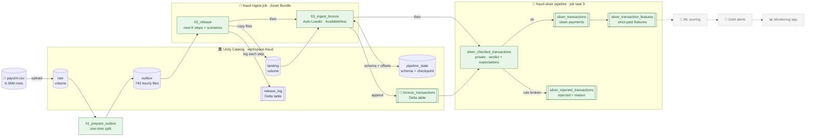

# 🛡️ Databricks Fraud Detection

## ⚡ Quick Summary

Mobile-money apps move millions of payments a day, and a small share of them
are fraud. This project builds the system a bank's data team would use to
catch it. Transactions flow in continuously, get cleaned and organised, are
scored by a machine-learning model, and suspicious ones surface as alerts on
a dashboard. Everything runs on **Databricks**, the data platform many large
companies use for this work, using only its free tier.

The build is done in phases, and each phase is proven with real runs before
the next begins. **Phase 2 is done:** about 6 million simulated transactions
were streamed into the platform and checked against their expected counts.
Every count matched exactly. The runs included deliberately staged problems:
a file sent twice, a file that arrived late, a new column appearing
mid-stream, and corrupted values. **Phase 3 is done:** those transactions
are now checked against quality rules, copies are removed, bad rows are set
aside with the reason, and each payment gets warning signs, such as how many
payments its receiving account got in the previous 24 hours. Every count
again matched an independent calculation exactly.

### Streaming fraud detection on a Databricks lakehouse, built in verified steps, measured rather than claimed

---

## 🏷️ Project Badges

[](https://www.databricks.com/)
[](https://spark.apache.org/)
[](https://docs.databricks.com/aws/en/ingestion/cloud-object-storage/auto-loader/)
[](https://delta.io/)
[](https://docs.databricks.com/aws/en/data-governance/unity-catalog/)
[](https://docs.databricks.com/aws/en/dev-tools/bundles/)

[](https://www.python.org/)
[](tests/README.md)
[](https://github.com/deepan-mehta-analytics/databricks-fraud-detection/actions)
[](https://github.com/deepan-mehta-analytics/databricks-fraud-detection/releases)
[](PROJECT-STATUS.md)
[](docs/exam-guide-map.md)
[](LICENSE)

---

## 📌 Project Overview

This project implements **an event-driven fraud pipeline on the Databricks
lakehouse**. Every architecture claim is checked against current docs or a
real run before it is adopted.

It uses the [PaySim](https://www.kaggle.com/datasets/ealaxi/paysim1)
mobile-money simulation (6.36M transactions) and replays it as a live event
stream through **Auto Loader into a Unity Catalog medallion layout**.

**✅ Implemented and verified (Phase 2: ingest to Bronze)**

- **Replayable event stream**: a splitter turns the CSV into 743 hourly JSON Lines files, and a release task drops them into a landing volume a few hours at a time
- **Auto Loader ingest**: incremental file discovery, pinned schema hints, `addNewColumns` schema evolution, rescued data, and an exactly-once checkpoint on a UC Volume
- **Staged failure scenarios**: duplicate delivery, late arrival, a new column mid-stream and malformed values, each switched on per run and each proven with a SQL check
- **Jobs as code**: a three-task Databricks job (release → ingest → silver) and the Silver pipeline, declared in an Asset Bundle with shared catalog/schema variables and deployed from the workspace UI, with no token
- **Guarded parameters**: scenario settings that can't take effect raise an error before any file is copied
- **Tested and CI-gated**: 115 local unit tests, and a GitHub Actions job running hygiene checks plus tests on every push
- **Exam-skills coverage map**: every Data Engineer Associate exam item mapped to repo evidence (15 of 33 shown), with short concept notes in [`docs/concepts/`](docs/concepts/)

**✅ Implemented and verified (Phase 3: Silver)**

- **Declarative pipeline**: a Lakeflow pipeline of four SQL materialized views, run as a job task after ingest, serverless and triggered
- **Quality rules with quarantine**: every Bronze row gets a verdict; nine expectations count each rule on the Data quality tab, clean rows go to `silver_transactions` (with fail-loud guards), and rejected rows go to a shelf with their reason
- **Duplicate handling**: the first arrival of each `transaction_id` is kept, identical copies are dropped and counted, and conflicting copies are rejected
- **Point-in-time features**: six receiver features (the "mule account" signal) and one sender feature, from earlier hours only, with no leakage from the same hour
- **Late data corrected**: a file released late updates the affected features on the next refresh, which was proven in a staged run
- **Measured refresh**: the full build and the later incremental refreshes were read from the pipeline event log, not assumed

**🔜 Planned**

- **ML** (built, workspace verification in progress): fraud model training with MLflow and the Unity Catalog model registry, and batch scoring after each data load
- **Gold and governance**: alert tables, group grants, row filters and column masks
- **Monitoring app**: alert dashboard and job alerting

**🧭 Engineering principles**

- **Research first**: every claim in the original brief is re-verified and logged in [`docs/GAPS.md`](docs/GAPS.md) before adoption
- **Measured results only**: no number is reported unless it came from a real run
- **Decisions on record**: eight ADRs in [`docs/adr/`](docs/adr/) capture each choice and what it cost, summarised in [Key Design Choices](#-key-design-choices)
- **Cost-disciplined and public-safe**: free tier only, placeholders for every workspace identifier

---

## ⚙️ Tech Stack

| Layer | Tool | Purpose |
|---|---|---|
| ☁️ Platform | Databricks Free Edition (serverless) | Compute, jobs, SQL warehouse; limits verified (G-08) |
| 📥 Ingestion | Auto Loader (`cloudFiles`) | Incremental JSON Lines ingest with schema hints, evolution and rescued data |
| 🔄 Stream engine | Spark Structured Streaming, `Trigger.AvailableNow` | Batch-style streaming, the trigger serverless supports (G-02) |
| 🗄️ Storage | Delta Lake | Append-only Bronze table and the release log |
| 🥈 Transformation | Lakeflow declarative pipeline (SQL materialized views, expectations) | Silver: quality rules, quarantine, dedup and strict-past window features, refreshed incrementally on serverless |
| 🏛️ Governance | Unity Catalog: schema, 4 Volumes, grants | Files, checkpoints and tables under one namespace; row filters and masks verified (G-06) |
| 💾 Checkpoints | Unity Catalog Volume | DBFS root is deprecated (G-03) |
| 🧩 Orchestration | Databricks Jobs + Asset Bundle (`databricks.yml`) | Three-task job (two notebooks and a pipeline task) plus the pipeline, as code, deployed from the workspace UI (G-11) |
| 🔗 Code delivery | Databricks Git folder | Workspace runs use this repo at a known commit (G-12) |
| 🐍 Language | Python 3.11, SQL | Splitter, release logic, scenario transforms, a local Silver reference model (stdlib only); model code with scikit-learn and pandas; Silver in SQL |
| 🧪 Testing | pytest (115 tests), PyYAML | Contract, split, scenarios, release, ingest options, job and pipeline definitions, Silver reference model and SQL guards, model windows, features, metrics, training and scoring |
| ⚙️ CI | GitHub Actions | Hygiene check + unit tests on every push |
| 📊 Data | PaySim (CC BY-SA 4.0) | Synthetic mobile-money transactions with fraud labels |

---

## 🎯 Business Problem

Fraud teams need suspicious payments flagged fast, from data that arrives
continuously and messily: late, duplicated, with changing formats. Real
streaming stacks (Kafka, dedicated clusters) are expensive to run, and on
this free tier they are blocked outright (G-01).

> **How quickly can a mobile-money transaction be flagged as likely fraud,
> and can the whole path — messy ingest to alert — be shown end to end on
> free infrastructure, with every number measured?**

---

## 🏗️ Architecture


```mermaid
flowchart LR
    CSV[("📄 paysim.csv<br/>6.36M rows")]

    subgraph UC["🏛️ Unity Catalog · workspace.fraud"]
        direction LR
        RAW[("raw<br/>volume")]
        OUT[("outbox<br/>743 hourly files")]
        LAND[("landing<br/>volume")]
        STATE[("pipeline_state<br/>schema + checkpoint")]
        LOG[["release_log<br/>Delta table"]]
        BRONZE[["🥉 bronze_transactions<br/>Delta table"]]
    end

    subgraph JOB["🧩 fraud-ingest job · Asset Bundle"]
        direction TB
        REL["02_release<br/>next K steps + scenarios"]
        ING["03_ingest_bronze<br/>Auto Loader · AvailableNow"]
        REL -->|then| ING
    end

    SPLIT["01_prepare_outbox<br/>one-time split"]

    CSV -->|upload| RAW --> SPLIT --> OUT
    OUT --> REL
    REL -->|copy files| LAND
    REL -->|log each step| LOG
    LAND --> ING
    ING <-->|schema + offsets| STATE
    ING -->|append| BRONZE

    subgraph PIPE["🥈 fraud-silver pipeline · job task 3"]
        direction TB
        CHK["silver_checked_transactions<br/>private · verdict + expectations"]
        CLEAN[["silver_transactions<br/>clean payments"]]
        REJ[["silver_rejected_transactions<br/>rejected + reason"]]
        FEAT[["silver_transaction_features<br/>strict-past features"]]
        CHK -->|ok| CLEAN
        CHK -->|rule broken| REJ
        CLEAN --> FEAT
    end

    ING -->|then| CHK
    BRONZE --> CHK

    FEAT -.-> ML["🤖 ML scoring"]
    ML -.-> GOLD["🥇 Gold alerts"]
    GOLD -.-> APP["📊 Monitoring app"]

    classDef planned fill:#f5f5f5,stroke:#999,stroke-dasharray:4 3,color:#666
    classDef done fill:#e8f5e9,stroke:#2e7d32,color:#1b5e20
    class ML,GOLD,APP planned
    class REL,ING,SPLIT,BRONZE,CHK,CLEAN,REJ,FEAT done
```

*Solid lines are built and verified; dashed nodes are planned phases.*

| Component | Type | Role |
|---|---|---|
| `01_prepare_outbox` | Notebook (one-time) | Splits the CSV into 743 per-hour JSON Lines files, 336 backfill / 72 replay / 335 drift |
| `02_release` | Job task 1 | Copies the next K steps into `landing`, applies any scenario flags, logs each step |
| `03_ingest_bronze` | Job task 2 | Auto Loader stream: reads new landing files, appends to Bronze, stops when caught up |
| `release_log` | Delta table | One row per released or held step, the replay pointer |
| `bronze_transactions` | Delta table | Raw events plus `source_file`, `file_arrived_at`, `ingested_at`, `_rescued_data` |
| `pipeline_state` | UC Volume | Auto Loader schema location and streaming checkpoint |
| `silver_checked_transactions` | Private materialized view | Every Bronze row plus its verdict; nine warn expectations count each rule |
| `silver_transactions` | Materialized view | Clean payments: first copy only, fixed columns, three fail-loud guards |
| `silver_rejected_transactions` | Materialized view | Rows that broke a rule or conflicted, with `rejection_reason` and the raw evidence |
| `silver_transaction_features` | Materialized view | 6 receiver features + 1 sender feature, earlier hours only |

| Phase | Layer | Status |
|---|---|---|
| 0 | Research, gaps register, ADRs | 🔄 13 of 17 gaps resolved |
| 1 | Scaffolding, CI | ✅ Done |
| 2 | Ingest to Bronze | ✅ Verified 2026-09-24 |
| 3 | Silver and features | ✅ Verified 2026-10-06/07 (S1–S6) |
| 4 | Training and scoring | 🔄 Built 2026-10-08; workspace checks M1–M4a passed (both training runs exact, v1 promoted), first scoring run next |
| 5 | Gold alerts and governance | ⏳ |
| 6 | Monitoring app and alerting | ⏳ |
| 7 | Live demo window and teardown | ⏳ |

---

## 📁 Repository Structure

```
databricks-fraud-detection/
│
├── src/fraud_ingest/              ← stdlib-only package, unit-tested locally
│   ├── contract.py                ← record contract: segments, file names, IDs, timestamps, schema hints
│   ├── split.py                   ← CSV → 743 hourly JSON Lines files
│   ├── scenarios.py               ← schema-change and malformed-value transforms
│   ├── release.py                 ← release pointer, flag validation, per-run copy
│   ├── release_log.py             ← in-memory + Delta release-log stores
│   └── ingest.py                  ← Auto Loader options and stream builder
├── src/fraud_model/               ← Phase 4 model code, unit-tested locally (no Spark)
│   ├── windows.py                 ← training/comparison windows, label delay, defaults
│   ├── features.py                ← the one feature builder for training, scoring and evaluation
│   ├── metrics.py                 ← precision/recall at 50 alerts per hour, PR-AUC
│   ├── training.py                ← model builders, comparison, scoring helper, importances
│   ├── scoring.py                 ← scoring decision-log schema and rows
│   └── runtime.py                 ← library-version and "no model yet" guards
├── src/fraud_silver/expected.py   ← local Silver reference model (expected counts and features)
├── scripts/expected_silver.py     ← prints the expected Silver numbers from data/paysim.csv
│
├── pipelines/                     ← Lakeflow pipeline sources (see pipelines/README.md)
│   └── silver/
│       ├── 01_checked_transactions.sql  ← private verdict view + 9 expectations
│       ├── 02_transactions.sql          ← clean payments + fail guards
│       ├── 03_rejected_transactions.sql ← rejected shelf with reason
│       └── 04_transaction_features.sql  ← strict-past window features
│
├── notebooks/                     ← Databricks entry points
│   ├── 01_prepare_outbox.py       ← one-time split (V1)
│   ├── 02_release.py              ← job task: release next steps
│   ├── 03_ingest_bronze.py        ← job task: Auto Loader → Bronze
│   ├── 04_train_model.py          ← fraud-train job: fit, compare, register @challenger
│   ├── 05_score_transactions.py   ← job task: score new payments with @champion
│   ├── 06_promote_model.py        ← owner-run: move @champion to a version
│   ├── 07_evaluate_model.py       ← owner-run: after-the-fact evaluation vs baselines
│   └── 99_reset.py                ← drop state to rerun from scratch
│
├── sql/
│   ├── 10_fraud_ingest_setup.sql  ← schema, 4 volumes, release_log (run once)
│   ├── 20_verify_bronze.sql       ← V2–V4 checks + one-row check of every proof
│   ├── 30_silver_setup.sql        ← Bronze table properties for incremental refresh
│   ├── 31_verify_silver.sql       ← Silver checks S2–S6
│   └── 40_verify_model.sql        ← model checks M4, M5, M7
│
├── resources/
│   ├── fraud_ingest_job.yml       ← job: release → ingest → silver → score, retries, paused schedule
│   ├── fraud_train_job.yml        ← on-demand training job
│   └── fraud_silver_pipeline.yml  ← Silver Lakeflow pipeline (serverless, triggered)
├── databricks.yml                 ← Asset Bundle root (dev target, catalog/schema variables)
│
├── tests/                         ← 115 pytest tests (see tests/README.md)
├── docs/
│   ├── adr/                       ← ADRs 0001–0008
│   ├── GAPS.md                    ← brief-vs-reality register + accepted limitations
│   ├── ENGINEERING-DECISIONS.md   ← decision log
│   ├── cost-model.md              ← free-tier cost tracking
│   ├── exam-guide-map.md          ← DE Associate skills-coverage map (33 items)
│   ├── exam-guide-delta.md        ← log of each re-check against the exam guide
│   ├── concepts/                  ← short plain-English notes for each shown skill
│   └── 00-initial-brief.md        ← original non-binding brief
│
├── app/                           ← monitoring app (Phase 6)
├── data/                          ← local datasets (gitignored)
├── .github/workflows/ci.yml       ← hygiene + unit-test jobs
├── Makefile                       ← check-hygiene, test (lint/deploy/teardown: honest stubs)
├── pyproject.toml                 ← pytest config
├── requirements-dev.txt           ← pytest, PyYAML, scikit-learn, pandas
├── .env.example                   ← placeholder configuration
└── PROJECT-STATUS.md              ← phase tracker
```

---

## ▶️ How to Run

### 💻 Option 1: Local unit tests (no Databricks needed)

#### 1. Clone and install
```bash
git clone https://github.com/deepan-mehta-analytics/databricks-fraud-detection.git
cd databricks-fraud-detection
python -m pip install -r requirements-dev.txt
```

#### 2. Run the checks
```bash
python -m pytest -q      # 115 unit tests (or: make test)
make check-hygiene       # no local-only or secret file is tracked
make help                # lint / deploy / teardown are stubs until their phase lands
```

### ☁️ Option 2: Databricks Free Edition workspace

This is the path used for the 2026-09-24 (Bronze) and 2026-10-06/07 (Silver)
verifications. Every step is done by hand in the workspace UI.

1. **Git folder**: Workspace → Home → Create → Git folder → this repo's URL. A public clone needs no token (G-12)
2. **Setup SQL**: in the SQL editor, on a **SQL warehouse**, run `sql/10_fraud_ingest_setup.sql` once
3. **Data**: download PaySim, then Catalog → `workspace.fraud.raw` → upload `paysim.csv`
4. **Split (V1)**: run `notebooks/01_prepare_outbox` on serverless; it prints `V1 passed`
5. **Deploy the job**: open `databricks.yml` → deployments icon 🚀 → target `dev` → Deploy (G-11)
6. **Run the job** in this order. Scenario settings go in **Run now ⌄ → Run now with different settings**, which applies them to that run only; never edit the job's defaults:

   | Run | Settings | Releases |
   |---|---|---|
   | 1 | none | backfill, steps 1–336 |
   | 2 | none | 337–342 |
   | 3 | `duplicate_step=340`, `hold_steps=345` | 343–348 without 345, plus a copy of 340 |
   | 4 | `malformed_step=350`, `malformed_rows=5` | 349–354 |
   | 5 | `release_held=true`, `schema_change_from_step=360` | 355–360 plus the late 345; ingest fails once, then retries |
   | 6 | `steps_per_run=48` | 361–408 |
   | 7 | none | nothing: prints "Nothing to release" |

   The `silver` task runs after ingest in every run above. If the pipeline is deployed only after Bronze already exists, do step 8 first, then run the job once with no settings.

7. **Verify Bronze**: run the one-row check at the end of `sql/20_verify_bronze.sql` and compare with the Results below
8. **Silver setup**: run `sql/30_silver_setup.sql` once Bronze exists. It turns on the table features that incremental refresh needs (deletion vectors, row tracking, change data feed)
9. **Verify Silver**: run the S2–S6 queries in `sql/31_verify_silver.sql`. The expected values are written inline. The S6 queries need the pipeline ID from the `fraud-silver` page, typed in the editor only
10. **Reset**: `notebooks/99_reset` drops the state and prints the rebuild order: re-ingest, run `30_silver_setup.sql`, then **Full refresh all** on the pipeline

### ⚙️ Option 3: CI (GitHub Actions)

Every push to `main` runs `.github/workflows/ci.yml`: a **hygiene** job (no
secrets or local-only files tracked) and a **test** job (Python 3.11,
pytest).

---

## 🧪 Tests

```bash
python -m pytest -q      # → 115 passed
```

| File | What it covers |
|---|---|
| `test_contract.py` | Segment boundaries, file naming, transaction ID and timestamp derivation, schema hints, volume paths |
| `test_split.py` | One file per step, field names and types, deterministic IDs, sort-order enforcement, custom anchor |
| `test_scenarios.py` | The `channel` and malformed-`amount` transforms in isolation |
| `test_release_core.py` | Backfill-first, K-per-run pacing, crash/resume repair, parameter validation, batched logging |
| `test_release_scenarios.py` | Duplicate, late, schema-change and malformed scenarios as applied by `run_release` |
| `test_ingest.py` | Auto Loader option construction; module imports without PySpark |
| `test_job_definition.py` | Bundle YAML: task graph, retry, schedule, parameter list, Silver pipeline, shared catalog/schema |
| `test_silver_expected.py` | Silver reference model: verdict rules, duplicate ranking, Bronze simulation, strict-past features, CLI |
| `test_silver_sql.py` | Text guards on the pipeline SQL: private view, expectations, fixed columns, strict-past frames |
| `test_model_windows.py` | Training and comparison windows for a 3-day and a 0-day label delay |
| `test_model_features.py` | Fixed feature list, forbidden columns, money and missing-value conversion, unknown payment types |
| `test_model_metrics.py` | Precision and recall at 50 alerts per hour, ties, empty windows, PR-AUC |
| `test_model_training.py` | Both models train on missing values, comparison picks the higher PR-AUC, importances, chunking |
| `test_model_scoring.py` | Decision-log schema and rows; the scoring code never reads the label |
| `test_model_runtime.py` | Only "not found" skips scoring; MLflow 3 and matching scikit-learn versions required |

Notebook behaviour, the Delta tables and Auto Loader itself are verified by
workspace runs (V1–V6, S1–S6 for Silver, M1–M7 for the model), not by this local suite. File-by-file detail is in
[`tests/README.md`](tests/README.md).

---

## 📊 Results / Performance

> **Phase 2 verified on Databricks Free Edition, 2026-09-24.** Serverless
> compute (performance-optimized jobs); code from this repo's Git folder at
> commit `601e7da`; job deployed as an Asset Bundle from the workspace UI.

### ✅ Correctness: every expected value matched exactly

| Check | Expected | Measured |
|---|---|---|
| V1 split: rows / fraud / files | 6,362,620 / 8,213 / 743 | ✅ exact |
| V2 after backfill: rows / fraud / distinct IDs | 4,784,775 / 3,767 / 4,784,775 | ✅ exact |
| V3 final: rows / fraud / distinct IDs | 5,987,427 / 4,599 / 5,987,417 | ✅ exact |
| Every row has a parsed event time (`null_times`) | 0 | ✅ 0 |
| 🔁 Duplicate file: step-340 IDs seen twice | 10 | ✅ 10 |
| ⏰ Late file: last step to arrive among 343–348 | 345 | ✅ 345 |
| 🧬 Schema change: `channel` before step 360 / missing from 360 on | 0 / 0 | ✅ 0 / 0 |
| 🩹 Malformed values kept in `_rescued_data` | 5 | ✅ 5 |
| New column: ingest fails once (`UNKNOWN_FIELD_EXCEPTION`), auto-retry succeeds | yes | ✅ yes |
| Replay finished: next run releases nothing | "Nothing to release" | ✅ printed |
| V6: job deploys as code on Free Edition | — | ✅ from the UI, no token |

### ⏱️ Runtimes (single runs, not averages)

| Run | What it did | Duration |
|---|---|---|
| Split notebook | 6.36M-row CSV → 743 JSON Lines files | ~7 min |
| Job run 1 | backfill: 336 files, 4,784,775 rows | 4m 22s |
| Job runs 2–5 | 6 steps each, plus the duplicate, late and malformed scenarios | 1m 0s – 1m 34s |
| Job run 6 | remaining 48 replay steps, 801,360 rows | 2m 35s |
| Job run 7 | nothing left: "Nothing to release" | 18s |

### 📉 Pipeline lag (`ingested_at − file_arrived_at`, per file, 409 files)

| Run | Files | Min / median / max (s) |
|---|---|---|
| Backfill | 336 | 48 / 127 / 193 |
| 6-step runs (2–5) | 25 | 14 / 20–28 (per-run medians) / 39 |
| 48-step run | 48 | 14 / 67 / 124 |

💡 **What the lag actually measures.** It reflects this batch design, not
Auto Loader's detection speed. The release task copies files one at a time
and ingest starts only when release finishes, so the first file copied in a
run waits longest. The ~14 s floor is the hand-off between the two tasks plus
stream start-up.

### 🥈 Phase 3 Silver, verified 2026-10-06/07

> Same workspace, code at commit `14fa8b3`. Expected values come from a
> pure-Python reference model (`scripts/expected_silver.py`) run over the
> same CSV, independent of Spark.

| Check | Expected | Measured |
|---|---|---|
| S2 row accounting: Bronze = clean + rejected + identical copies | 5,987,427 = 5,987,412 + 5 + 10 | ✅ exact |
| S2 Silver fraud / unique IDs | 4,589 / every ID unique | ✅ exact |
| S2 rejected reasons | `bad_amount` 5 (the malformed values) | ✅ exact |
| S3 Data quality tab: `amount_valid` / `fully_parsed` / `first_copy` failures | 5 / 5 / 10, all others 0 | ✅ exact |
| S4 no-peeking check: one receiver's 21 payments, all 7 features | pipeline = hand-written self-join = reference model | ✅ identical |
| S5 late file: step 413 held, then released late | a step-416 payment changes from no history to 1 payment, 348,118.37 | ✅ changed as calculated |

| S6 pipeline update | Refresh technique (from the event log) | Duration |
|---|---|---|
| First build | full recompute, all 4 views | 105 s |
| Drift run A | incremental: `WINDOW_FUNCTION` (verdict, features), `APPEND_ONLY` (clean, rejected) | 115 s |
| Drift run B (late file) | incremental, same techniques | 107 s |

💡 **What S6 shows.** The materialized views refreshed incrementally even with
expectations in place, but at about 6M rows that did not make updates faster:
fixed pipeline start-up and planning (about 1.5–2 minutes) dominates (G-15).

No model metrics yet: training starts in Phase 4.

---

## 🧩 Key Design Choices

The engineering decisions behind each layer. Every row links to an ADR with
the evidence and the alternatives rejected. Full narrative:
[`docs/ENGINEERING-DECISIONS.md`](docs/ENGINEERING-DECISIONS.md).

| Layer | Choice | Why | What production would add |
|---|---|---|---|
| Ingest | Replay the data as hourly files and ingest with Auto Loader, not Kafka ([ADR 0007](docs/adr/0007-file-based-ingest-with-auto-loader.md)) | Free Edition blocks outbound connections to an external broker (measured); files keep every step reproducible | A message bus (Kafka/Event Hubs) with sub-second delivery |
| Ingest | `Trigger.AvailableNow` jobs instead of an always-on stream ([ADR 0003](docs/adr/0003-streaming-trigger-model-on-serverless.md)) | The only streaming trigger serverless jobs support; no compute burns between file drops | Continuous streaming on dedicated compute where latency matters |
| Ingest | Pinned schema hints, `addNewColumns` evolution and rescued data | A bad value or a new column never silently breaks or drops data; it fails once by design and retries | Schema-registry contracts with the producing team |
| Ingest | A deterministic `transaction_id` stamped at the source | PaySim has no ID; a content hash would merge genuinely identical payments | IDs issued by the payment system itself |
| Ingest | Time-based train/score cut inside days 1–17 ([ADR 0006](docs/adr/0006-paysim-dataset-instead-of-synthetic-identifiers.md)) | Measured: normal volume collapses after day 17, so a later cut would compare a 0.1% fraud rate with 1.5% | The same rule: always split by time, never randomly |
| Silver | A Lakeflow declarative pipeline of materialized views ([ADR 0008](docs/adr/0008-silver-on-a-declarative-pipeline.md)) | Late files correct the results on the next refresh with no hand-written recompute logic; incremental refresh measured | Streaming tables with stateful dedup at bank scale |
| Silver | Verdict-then-split quarantine: warn expectations, a rejected shelf with the reason, fail-loud guards | Bad rows are counted and kept for review, never silently dropped; the row accounting must reconcile exactly | Alerting on rejected-row spikes (Phase 6 here) |
| Silver | Keep the first arrival, drop identical copies, reject conflicting ones; no upsert | Payments are immutable events: a changed copy is a data problem, not a newer version | The same, plus a watermark-bounded streaming dedup |
| Silver | Warning signs on the receiving account, from earlier hours only | Measured: senders almost never repeat, receivers do (the "mule" pattern); same-hour data would leak the future | An online feature store with millisecond lookups |
| Silver | Zero amounts allowed | All 4 zero-amount payments in the data are fraud; a "positive amount" rule would throw real fraud away | Rules reviewed with the fraud-operations team |
| Testing | A pure-Python reference model checks the SQL's results row for row | CI can't run Spark; the workspace runs were compared with an independent calculation | Integration tests on a dev workspace in CI |

---

## 📈 Scaling Considerations

This project runs about 6M payments on Databricks Free Edition (serverless
only, one active pipeline, an unpublished daily quota). Each choice above is
the right size for that. The table names the heavier pattern a team would
reach for as volume or latency needs grow.

| Concern | Pattern | When to adopt | In this repo now |
|---|---|---|---|
| Event delivery | Files plus Auto Loader | Batch-like arrival, minutes of latency are fine | ✅ |
| Event delivery | Kafka plus Structured Streaming | Sub-second latency or many producers | — (blocked on Free Edition, G-01) |
| Transformation | Materialized views in a triggered pipeline | Millions of rows, late data must correct results | ✅ (incremental refresh measured) |
| Transformation | Streaming tables plus stateful dedup | Continuous, high-volume, append-only streams | — |
| Features | Window features computed in Silver | Batch scoring on a schedule | ✅ |
| Features | Online feature store and point-in-time training sets | Millisecond scoring at payment time | — (online tables unsupported on Free Edition) |
| Environments | One `dev` bundle target with shared variables | Single developer | ✅ |
| Environments | dev/test/prod targets with CI deploys | A team, with promotion gates | 🔜 Phase 3 add-on |

---

## 🎓 Exam Alignment

This repo doubles as verifiable skills coverage for the **Databricks
Certified Data Engineer Associate** exam guide: 15 of 33 official items are
shown with real code or a verified run, 5 more are designed (an ADR or a
`docs/GAPS.md` row), and 13 are not started. See the full breakdown in
[`docs/exam-guide-map.md`](docs/exam-guide-map.md), and the study notes
building toward it in [`docs/concepts/`](docs/concepts/). This is a skills
coverage map, not exam prep. Several ✅ rows are partial rather than
complete — the map's Skill column always says exactly what is and isn't
shown.

---

## ⚠️ Known Limitations

- **Single verification day**: Phase 2 figures are single runs, not averages. The daily compute quota is unpublished. Phase 2's runs fit inside one day's allowance; on 2026-10-08, after a day of Phase 4 runs (deploy, two training runs, two job runs), a job's Silver step was refused with `CLUSTER_CREATION_RESOURCE_EXHAUSTED`, so heavy verification days are split across days (G-08)
- **Invalid JSON loses its text**: a line that is not valid JSON lands in Bronze as one all-null row (its text is lost, and the run succeeds). Silver rejects such a row as `missing_id` onto the rejected shelf, so it is visible there, but the original text cannot be recovered (GAPS §3, V5)
- **Hourly features and warm-up**: PaySim time is in whole hours, so the features count earlier hours only, never the same hour. The first 24 hours have partial history (GAPS §3, S-HOURS)
- **SQL logic is not unit-tested in CI**: CI checks the Silver SQL's structure (names, frames, column lists, guards). The logic is proven by the workspace runs against the reference model (GAPS §3, CI-SQL)
- **Reset needs a manual full refresh**: after a Bronze reset, Silver keeps its old results until someone clicks **Full refresh all** on the pipeline (GAPS §3, S-RESET)
- **Batch-sized Silver**: materialized views fit 6M rows. At bank scale this would be streaming tables plus a feature store with online lookups (ADR 0008)
- **No Kafka on this tier**: serverless compute cannot even resolve untrusted hostnames (measured), so Confluent Kafka is out. Events are replayed as files instead (G-01)
- **Not sub-second streaming**: Real-Time Mode needs classic compute. Serverless supports `AvailableNow` and Lakeflow pipelines only (G-02)
- **Synthetic, uneven data**: PaySim is a simulation. Legitimate volume collapses after simulated day 17 while fraud stays constant, so days 1–17 are used for training and scoring, and days 18–31 are held back as a drift scenario (G-10)
- **Storage duplication**: landing files are kept after ingest, so the data sits in the workspace about three times (CSV, outbox, landing) plus Bronze. There is no stated storage quota; `cleanSource` archiving is not yet implemented
- **Retry with changed flags**: if a failed release is retried with different scenario flags, a step can land twice; recovery is `99_reset`
- **Open gaps**: G-05 (model metrics, which need training), G-09 (cost recompute), G-16 (Feature Engineering on Free Edition) and G-17 (Phase 4 carry-overs: a scoring decision log, label delay, warm-up hours) in [`docs/GAPS.md`](docs/GAPS.md)
- **Exam items out of scope for this project**: 2.2 (COPY INTO), 2.4 (Lakeflow Connect) and 2.5 (JDBC/ODBC/REST landing) are not planned — see [`docs/exam-guide-map.md`](docs/exam-guide-map.md) for why
- **Keyless CI/CD unavailable**: Keyless OIDC deploys from GitHub Actions need a Databricks account console, which Free Edition does not have, so CI deploys will use a stored credential in a protected GitHub environment instead ([docs](https://docs.databricks.com/aws/en/dev-tools/auth/oauth-federation-policy), checked 2026-09-27)

---

## 🔜 Roadmap

- [ ] Phase 0: research and ADRs (13 of 17 gaps resolved)
- [x] Phase 1: scaffolding and CI
- [x] Phase 2: ingest to Bronze (44 unit tests at ship; workspace V1–V6 verified 2026-09-24)
- [x] Phase 3: Silver (quality rules with quarantine, dedup on `transaction_id`, strict-past velocity features; workspace S1–S6 verified 2026-10-06/07)
- [ ] Phase 3 add-on: dev and prod bundle targets, and CI deploys from a protected GitHub environment (exam items 5.2, 5.4)
- [ ] Phase 4: ML training and batch scoring (built 2026-10-08; workspace checks in progress)
- [ ] Phase 5: Gold alerts and Unity Catalog governance
- [ ] Phase 6: monitoring app and alerting
- [ ] Phase 7: live demo window and teardown
- [x] Databricks Data Engineer Associate coverage map

---

## 📂 Dataset

**[PaySim](https://www.kaggle.com/datasets/ealaxi/paysim1)** mobile-money
transaction simulator · licence **CC BY-SA 4.0** · chosen in ADR 0006 over
the originally planned Kaggle Credit Card Fraud dataset (G-04).

| Property | Value (verified from the downloaded file) |
|---|---|
| Rows | 6,362,620 |
| Fraud (`isFraud=1`) | 8,213 (~0.129%) |
| Flagged fraud (`isFlaggedFraud=1`) | 16 |
| Time span | steps 1–743, 1 step = 1 hour (~30 days) |
| Columns | `step, type, amount, nameOrig, oldbalanceOrg, newbalanceOrig, nameDest, oldbalanceDest, newbalanceDest, isFraud, isFlaggedFraud` |

⚠️ The balance columns leak the label (they are zeroed after fraud), so they
are excluded from features (ADR 0006). Volume is not uniform over time (G-10).

---

## 📜 License

Released under the MIT License. See [`LICENSE`](LICENSE).

---

## 👤 Author

**Deepan Mehta**

- Data Analytics → Data Engineering → AI/ML Engineering
- Focused on building end-to-end data and ML systems combining analytics, automation, and deployment
- Experience in ETL pipelines, streaming ingest, predictive modelling, and analytical databases

🔗 GitHub: [deepan-mehta-analytics](https://github.com/deepan-mehta-analytics)
